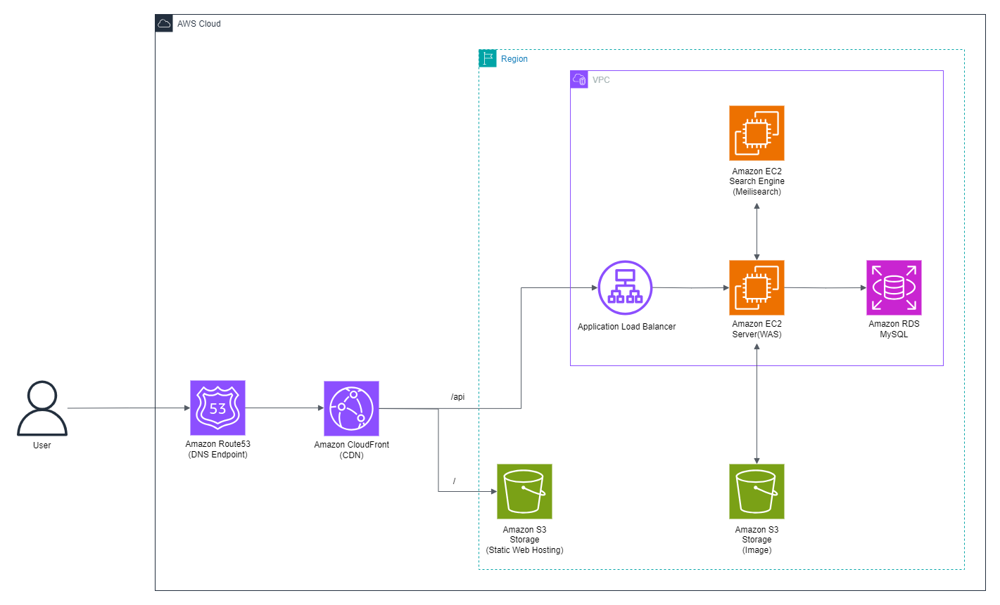
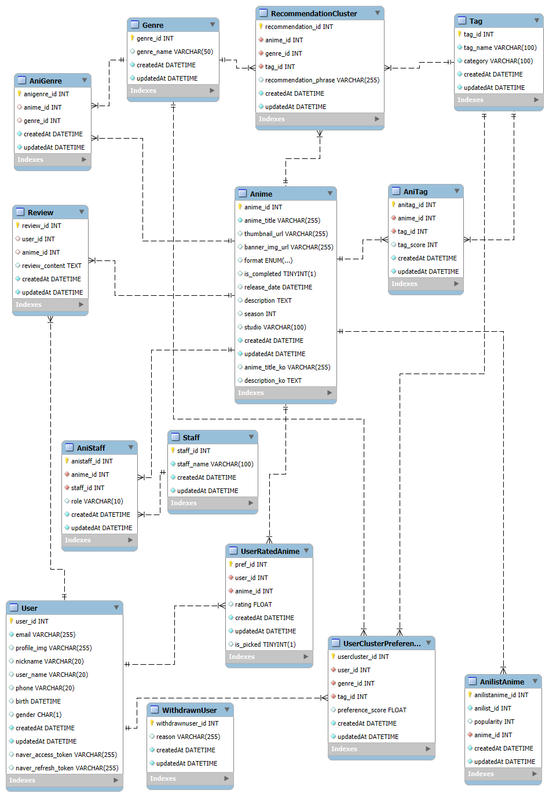

# AnnPick

> 취향을 기반으로 애니메이션을 추천해 드립니다.


[바로가기](https://annpick.link)

## 프로젝트 개요

### 1. 프로젝트 주제

- 애니메이션 취향을 분석하고 큐레이팅하는 서비스

### 2. 메인/서브 기능

```markdown
1. Recommendation MVP : 취향 분석 및 추천 기능
2. Information MVP : 애니메이션 정보 제공
3. Search MVP : 제목, 장르, 태그로 애니 검색
4. Rating MVP : 평점 저장 및 북마크(픽하기) 기능
5. User MVP : 로그인, 회원가입, 회원정보 수정, 회원 탈퇴
```

### 3. 프로젝트 팀원

| 이름   | 역할        |
| ------ | ----------- |
| 김서정 | 팀장 / 기획 |
| 최윤석 | 기획        |
| 김수현 | 프론트엔드  |
| 정혜주 | 풀스택      |

---

## 프로젝트 구조

### 아키텍처



### ERD



### 디렉토리 구조

<details>
<summary>Front-end</summary>

```
frontend/                                # 프론트엔드 관련 파일들
├── node_modules/                        # 프로젝트 종속성 모듈
├── public/                              # 정적 파일들
│   ├── images/                          # 이미지 파일들
│   ├── favicon.ico                      # 파비콘 파일
│   └── index.html                       # 메인 HTML 파일
├── src/                                 # 소스 코드
│   ├── assets/                          # 정적 자산 파일들
│   │   ├── font/                        # 폰트 파일들
│   │   └── icons/                       # 아이콘 파일들
│   ├── components/                      # 재사용 가능한 UI 컴포넌트(위젯)
│   │   ├── anime/                       # 애니메이션 관련 컴포넌트
│   │   │   ├── AnimeCard.tsx            # 애니메이션 카드 컴포넌트
│   │   │   └── AnimeList.tsx            # 애니메이션 슬라이더 리스트 컴포넌트
│   │   ├── auth/                        # 인증 관련 컴포넌트
│   │   │   └── LoginModal.tsx           # 로그인 모달 컴포넌트
│   │   ├── common/                      # 공통 컴포넌트
│   │   │   ├── LoadingSpinner.css       # 로딩 스피너 스타일
│   │   │   ├── LoadingSpinner.tsx       # 로딩 스피너 컴포넌트
│   │   │   └── SwipeButton.tsx          # 스와이프 버튼 컴포넌트
│   │   ├── error/                       # 에러 처리 관련 컴포넌트
│   │   │   └── ErrorBoundary.tsx        # 에러 경계 컴포넌트
│   │   ├── layout/                      # 레이아웃 관련 컴포넌트
│   │   │   ├── Footer.tsx               # 푸터 컴포넌트
│   │   │   └── Header.tsx               # 헤더 컴포넌트
│   │   ├── mypage/                      # 마이페이지 관련 컴포넌트
│   │   │   └── AvatarDropdown.tsx       # 아바타 드롭다운 컴포넌트
│   │   ├── promotion/                   # 프로모션 관련 컴포넌트
│   │   │   └── PromotionBanner.tsx      # 프로모션 배너 컴포넌트
│   │   ├── review/                      # 리뷰 관련 컴포넌트(2차 개발)
│   │   │   └── .gitkeep                 # 추후 구현을 위한 빈 파일
│   │   └── search/                      # 검색 관련 컴포넌트
│   │       ├── EvaluationSearchGrid.tsx # 평가 페이지 검색 그리드 컴포넌트
│   │       ├── RecentSearches.tsx       # 최근 검색어 컴포넌트
│   │       ├── SearchFilters.tsx        # 검색 필터 컴포넌트
│   │       └── SearchSuggestions.tsx    # 검색 제안 컴포넌트
│   ├── config/                          # 설정 파일들
│   │   ├── constants.ts                 # 상수 정의
│   │   ├── react-app-env.d.ts           # React 앱 환경 타입 정의
│   │   ├── reportWebVitals.ts           # 웹 성능 측정
│   │   ├── sections.ts                  # 섹션 관련 설정
│   │   ├── setupTests.ts                # 테스트 설정
│   │   └── TagCategories.ts             # 태그 카테고리 정의
│   ├── contexts/                        # React Context 관련 파일들
│   │   ├── AnimeContext.tsx             # 애니메이션 관련 컨텍스트
│   │   └── AuthContext.tsx              # 전역 인증 상태 관리 컨텍스트
│   ├── pages/                           # 페이지 컴포넌트들
│   │   ├── anime/                       # 애니메이션 관련 페이지
│   │   │   ├── AnimeDetail.tsx          # 애니메이션 상세 페이지
│   │   │   └── AnimeSearch.tsx          # 애니메이션 검색 페이지
│   │   ├── profile/                     # 프로필 관련 페이지
│   │   │   ├── MyPicks.tsx              # 픽한 애니메이션 페이지
│   │   │   ├── MyRatings.tsx            # 내 평가 페이지
│   │   │   └── Profile.tsx              # 프로필 페이지
│   │   ├── terms/                       # 약관 관련 페이지
│   │   │   ├── MarketingAgreement.tsx   # 마케팅 동의 약관 페이지
│   │   │   ├── PrivacyPolicy.tsx        # 개인정보 처리방침 페이지
│   │   │   └── TermsOfService.tsx       # 서비스 이용 약관 페이지
│   │   ├── EvaluationPage.tsx           # 평가 페이지
│   │   ├── Home.tsx                     # 홈 페이지
│   │   └── NotFound.tsx                 # 404 Not Found 페이지
│   ├── service/                         # 서비스 관련 파일들
│   │   ├── SearchHooks.ts               # 검색 관련 커스텀 훅
│   │   ├── SearchUtils.ts               # 검색 유틸리티 함수들
│   │   └── useHover.ts                  # 호버 관련 커스텀 훅
│   ├── styles/                          # 스타일 관련 파일들
│   │   ├── globals.css                  # 전역 스타일
│   │   └── tailwind.css                 # Tailwind CSS 설정
│   ├── types/                           # 타입 정의 파일들
│   │   ├── anime.ts                     # 애니메이션 관련 타입 정의
│   │   └── auth.ts                      # 인증 관련 타입 정의
│   ├── App.css                          # 앱 전체 스타일
│   ├── App.tsx                          # 앱의 메인 컴포넌트
│   ├── index.css                        # 인덱스 페이지 스타일
│   └── index.tsx                        # 앱의 진입점
├── .env                                 # 환경 변수 파일
├── package-lock.json                    # 패키지 버전 잠금 파일
├── package.json                         # 프로젝트 설정 및 종속성 정의
├── tailwind.config.js                   # Tailwind CSS 설정 파일
└── tsconfig.json                        # TypeScript 설정 파일
```

</details>
<br>
<details>
<summary>Back-end</summary>

```
backend/                                  # 백엔드 관련 파일들
├── data/                                 # 데이터 관련 파일들
│   ├── anime_data.json                   # 애니메이션 데이터 인덱싱 파일(Meilisearch)
│   └── meilisearch.service               # MeiliSearch 서비스 파일
├── scripts/                              # 스크립트 파일들
│   ├── deleteNonTVAnimes                 # TV 애니메이션이 아닌 항목 삭제 스크립트
│   ├── populateRecommendationClusters.js # 추천 클러스터 생성 스크립트
│   ├── saveAnimeData.js                  # 애니메이션 데이터를 AniList API에서 불러와 저장하는 스크립트
│   ├── translateGenres.js                # 장르 번역 스크립트
│   └── translateTags.js                  # 태그 번역 스크립트
├── src/                                  # 소스 코드
│   ├── config/                           # 설정 파일들
│   │   ├── appConfig.js                  # 앱 설정
│   │   ├── authConfig.js                 # 인증 및 소셜 로그인 전략 설정
│   │   ├── config.js                     # 일반 설정
│   │   ├── dbConfig.js                   # 데이터베이스 설정
│   │   ├── meiliConfig.js                # MeiliSearch 설정
│   │   └── swaggerConfig.js              # Swagger 설정
│   ├── controllers/                      # 컨트롤러 파일들
│   │   ├── animeController.js            # 애니메이션 관련 컨트롤러
│   │   ├── authController.js             # 인증 관련 컨트롤러
│   │   ├── pickController.js             # 픽하기 관련 컨트롤러
│   │   ├── recommendController.js        # 추천 관련 컨트롤러
│   │   └── userController.js             # 회원 정보 관련 컨트롤러
│   ├── middleware/                       # 미들웨어 파일들
│   │   ├── authMiddleware.js             # 인증 미들웨어
│   │   └── multer.js                     # 파일 업로드 미들웨어
│   ├── models/                           # 모델 파일들
│   │   ├── AniGenre.js                   # 애니메이션-장르 모델
│   │   ├── AnilistAnime.js               # AniList 아이디 조회를 위한 모델
│   │   ├── Anime.js                      # 애니메이션 모델
│   │   ├── AniStaff.js                   # 애니메이션 스태프 모델
│   │   ├── AniTag.js                     # 애니메이션-태그 모델
│   │   ├── associations.js               # 모델 간 연관 관계
│   │   ├── Genre.js                      # 장르 모델
│   │   ├── index.js                      # 모델 인덱스 파일(내보내기)
│   │   ├── RecommendationCluster.js      # 추천 클러스터 모델
│   │   ├── Review.js                     # 리뷰 모델(2차 개발)
│   │   ├── Staff.js                      # 스태프 모델
│   │   ├── Tag.js                        # 태그 모델
│   │   ├── User.js                       # 사용자 모델
│   │   ├── UserClusterPreference.js      # 사용자 선호 정보를 저장하는 모델
│   │   ├── UserRatedAnime.js             # 사용자가 평가/픽하기한 애니메이션 정보를 저장하는 모델
│   │   └── WithdrawnUser.js              # 탈퇴 회원 모델
│   ├── routes/                           # 라우트 파일들
│   │   ├── animeRoutes.js                # 애니메이션 관련 라우트
│   │   ├── authRoutes.js                 # 인증 관련 라우트
│   │   ├── pickRoutes.js                 # 픽하기 관련 라우트
│   │   ├── recommendRoutes.js            # 추천 관련 라우트
│   │   └── userRoutes.js                 # 회원 정보 관련 라우트
│   ├── services/                         # 서비스 파일들
│   │   ├── animeService.js               # 애니메이션 관련 서비스
│   │   ├── authService.js                # 인증 관련 서비스
│   │   ├── pickService.js                # 픽하기 관련 서비스
│   │   ├── recommendService.js           # 추천 관련 서비스
│   │   └── s3Service.js                  # AWS S3 관련 서비스
│   ├── utils/                            # 유틸리티 파일들
│   │   ├── animeFormatting.js            # 애니메이션 정보 포맷팅 유틸리티
│   │   └── animeTranslate.js             # 애니메이션 번역 유틸리티
│   ├── app.js                            # Express 앱 설정
│   └── server.js                         # 서버 시작 파일
├── .env                                  # 환경 변수 파일
├── package-lock.json                     # 패키지 버전 잠금 파일
└── package.json                          # 프로젝트 설정 및 종속성 정의
```

</details>

## 프로젝트 환경

### 1. 기술 스택

<details>
<summary>Front-end</summary>

- 프레임워크 및 라이브러리
  - `React` : 프론트엔드 UI 라이브러리
  - `React Router DOM` : 클라이언트 사이드 라우팅
  - `Axios` : HTTP 요청 처리
  - `Framer Motion` : 애니메이션 라이브러리
  - `React Icons` : 아이콘 컴포넌트
  - `React Markdown` : 마크다운 렌더링
  - `JWT Decode` : JWT 토큰 디코딩

* 스타일링
  - `Tailwind CSS` : 유틸리티 기반의 CSS 프레임워크
  - `DaisyUI` : Tailwind와 함께 사용하는 UI 컴포넌트 라이브러리
  - `@tailwindcss/forms` : Tailwind의 form 스타일링 확장
  - `@tailwindcss/typography` : 타이포그래피 확장(Markdown 등)
* 빌드 및 개발 도구
  - `npm` : 패키지 관리 도구로, 의존성 설치 및 스크립트 실행을 관리
  - `TypeScript` : 타입스크립트 사용

</details>
<br>
<details>
<summary>Back-end</summary>

- 서버 프레임워크
  - `Express` : 백엔드 애플리케이션의 주요 서버 프레임워크
- 인증 및 세션 관리
  - `passport` : 인증 미들웨어
  - `passport-naver` : 네이버 인증 지원
  - `passport-jwt` : JWT 토큰 인증 처리
  - `jsonwebtoken` : JWT 토큰 생성 및 검증
- 데이터베이스 및 ORM
  - `MySQL` : 데이터베이스로 사용
  - `sequelize` : MySQL과의 상호작용을 위한 ORM (Object-Relational Mapping)
  - `sequelize-cli` : Sequelize 데이터 마이그레이션 도구
- 파일 업로드 및 파싱
  - `multer` : 파일 업로드 처리 미들웨어
  - `body-parser` : 요청 본문 파싱
  - `cookie-parser` : 쿠키 파싱
- 검색 엔진
  - `meilisearch` : 검색 기능 구현
- API 문서화
  - `swagger-jsdoc` : Swagger 문서 생성
  - `swagger-ui-express` : Swagger UI를 Express에서 제공
- 환경 변수 관리
  - `dotenv` : 환경 변수 관리
- 클라우드 서비스
  - `aws-sdk` : AWS 서비스와 상호작용
- HTTP 요청 처리
  - `axios` : HTTP 클라이언트 라이브러리

</details>

### 2. 개발 환경

```
- Node.js : v20.17.0
- npm : v10.8.2
- git : v2.45.2
- OS : Windows_NT x64
- IDE : VSCode v1.90.2
```

### 3. 배포 환경

```
- 서버(WAS) : AWS EC2 (Express API 서버)
- 검색 서버 : AWS EC2 (MeiliSearch)
- 데이터베이스 : AWS RDS (MySQL)
- 스토리지 및 CDN : AWS S3, CloudFront
```

## 개발 문서

[설치 및 실행](/docs/installation.md)

[WBS](https://docs.google.com/spreadsheets/d/10T6W1k2AkRwmw0QwMH2H5F0rfvRBhQ6vu44VWWv_7-U/edit?usp=sharing)

[테이블 정의서](https://docs.google.com/spreadsheets/d/1abxsR-jKPNRI4qfe9dXE0NrXWX4AAo1sC5M0-JlBaVM/edit?gid=629411476#gid=629411476)

[API 명세서](http://43.203.213.200/api-docs/)

[팀 노션](https://www.notion.so/adapterz/3-8675874bc9ea4b4bb8e6964eda02a429?pvs=4)

## 개발 규칙

### 1. 코드 컨벤션

- 텍스트 작성 기본 설정: VSCode Prettier Extension 사용

#### Front-end

- 변수, 함수 camelCase 사용, Class는 PascalCase 사용
- 문자열에선 기본적으로 `""`를 씀 (특수한 경우 제외)

#### Back-end

- 변수, 함수 camelCase 사용, Class는 PascalCase 사용
- 파일 구조는 MVC 패턴 따름
- 문자열에선 기본적으로 `""`를 씀 (특수한 경우 제외)

### 2. Branch 전략(GitFlow)

- **main**: 제품으로 출시되는 브랜치
- **develop**: 개발 브랜치로 개발자들이 이 브랜치를 기준으로 각자 작업한 기능들을 merge
- **feature**: 단위 기능을 개발하는 브랜치로 기능 개발이 완료되면 develop 브랜치에 merge
- **release**: 배포를 위해 main 브랜치로 보내기 전 먼저 QA(품질검사)를 하기 위한 브랜치
- **hotfix**: main 브랜치로 배포를 했는데 버그가 생겼을 때 긴급 수정하는 브랜치

<details>
<summary>GitFlow 과정</summary>

```
- master 브랜치에서 develop 브랜치를 분기합니다.
- 개발자들은 develop 브랜치에 자유롭게 커밋을 합니다.
- 기능 구현이 있는 경우 develop 브랜치에서 feature-* 브랜치를 분기합니다.
- 배포를 준비하기 위해 develop 브랜치에서 release-* 브랜치를 분기합니다.
- 테스트를 진행하면서 발생하는 버그 수정은 release-* 브랜치에 직접 반영합니다.
- 테스트가 완료되면 release 브랜치를 master와 develop에 merge합니다.
```

</details>

### 3. 커밋 메시지

- `type(타입): title(제목)`
- 제목 첫글자는 대문자로(EN)
- 제목 끝에 마침표 등 특수문자 X
- 제목은 명령문으로 사용, 과거형 X
- `type`은 아래 명시된 형태로

| Type 키워드  | 사용 시점                                                              |
| ------------ | ---------------------------------------------------------------------- |
| **feat**     | 새로운 기능 추가                                                       |
| **fix**      | 버그 수정                                                              |
| **test**     | 기능 테스트                                                            |
| **docs**     | 문서 수정                                                              |
| **style**    | 코드 스타일 변경 (코드 포매팅, 세미콜론 누락 등) 기능 수정이 없는 경우 |
| **design**   | 사용자 UI 디자인 변경 (CSS 등)                                         |
| **test**     | 테스트 코드, 리팩토링 테스트 코드 추가                                 |
| **refactor** | 코드 리팩토링                                                          |
| **build**    | 빌드 파일 수정                                                         |
| **perf**     | 성능 개선                                                              |
| **chore**    | 빌드 업무 수정, 패키지 매니저 수정 (gitignore 수정 등)                 |
| **rename**   | 파일 혹은 폴더명을 수정만 한 경우                                      |
| **remove**   | 파일을 삭제만 한 경우                                                  |
